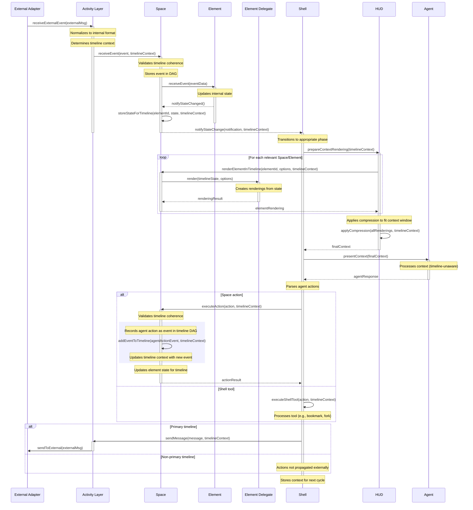

# Resonance Framework Architecture: Component Classification and Message Flow

## Component Classification

### Fundamental (F)
Core architectural elements that rarely change; modifications represent major framework revisions
- Space and Element concepts
- Event propagation core
- Shell-Element relationship model
- Activity layer abstraction
- Timeline/Loom management (event DAG structure)

### Stable (S)
Important patterns that evolve with backward compatibility
- Rendering API
- Element Delegate interface
- Normalized event protocols
- Space relationship models (mounting, focus)
- Compression API

### Dynamic (D)
Swappable implementations that can vary without affecting architecture
- Specific Shell implementations (two-phase, single-phase)
- Element implementations
- Compression algorithms
- Specific adapters
- UI rendering strategies


# Message Processing Flow (with Action Recording)



## Message Flow Sequence with Classification

### 1. External Event Reception (F/S/D)
```
// External adapter receives message (D)
Telegram_Adapter.receiveMessage(externalMessage)

// Normalization to standard protocol (S)
normalized = Adapter.normalizeToMessageProtocol(externalMessage)

// Determine timeline context (F)
timelineContext = {
  branchId: "primary-branch-001",
  isPrimary: true,
  lastEventId: "evt-45678"
}

// Routing through fundamental activity layer (F)
ActivityLayer.routeEvent(normalized, timelineContext)
```

The adapter implementation is Dynamic, but it conforms to a Stable protocol. The Activity Layer's existence and role is Fundamental.

### 2. Space Routing and Event Processing (F)
```
// Resolving target Space (F)
targetSpace = SpaceRegistry.resolveSpace(normalized.destination)

// Space receives event with timeline context (F)
targetSpace.receiveEvent(normalized.eventData, timelineContext)

// Validate timeline coherence (F)
if (targetSpace.isCoherentTimeline(timelineContext)) {
  // Space resolves timeline-specific element instance (F)
  chatElement = targetSpace.getElementForTimeline("main_chat", timelineContext)
  chatElement.processEvent(normalized.eventData)
}
```

The routing mechanism between Spaces and Elements is Fundamental to the architecture. How a specific Space resolves which Element should receive an event is also Fundamental.

### 3. Element State Update (S/D)
```
// Chat Element processes event (D)
ChatElement.processEvent(eventData) {
  // Implementation-specific state update
  this.addMessageToHistory(eventData)
  
  // Conforming to stable Element interface (S)
  this.notifyStateChanged()
}
```

The specific implementation of the Chat Element is Dynamic, but it adheres to a Stable interface pattern for all Elements. The concept that Elements manage their own state is Stable.

### 4. Shell Notification (F/S)
```
// Element notifies Shell of state change (F)
Element.notifyStateChanged()

// Space passes timeline context to Shell (F)
Space.notifyShellOfUpdate(elementId, timelineContext)

// Shell receives notification with timeline context (F)
Shell.handleElementStateChange(elementId, spaceId, timelineContext)

// Shell decides whether to update context (S)
if (Shell.shouldUpdateContext()) {
  Shell.initiateContextUpdate(timelineContext)
}
```

The notification pathway between Elements and the Shell is Fundamental. The decision logic for context updates falls into Stable territory - different Shell implementations can handle this differently.

### 5. Shell Phase Management (D)
```
// Two-Phase Shell implementation (D)
TwoPhaseShell.initiateContextUpdate() {
  // Implementation-specific phase transition
  this.currentPhase = "contemplation"
  
  // Calls to stable Shell APIs (S)
  this.renderCurrentContext()
}
```

The specific implementation of a two-phase interaction model is Dynamic. Different Shells could implement single-phase interaction, guided exploration, or other models while still using the Stable shell APIs.

### 6. Rendering Request Flow (F/S)
```
// Shell initiates rendering (F)
Shell.renderCurrentContext() {
  // Collect render targets (F)
  renderTargets = this.collectRenderTargets()
  
  // Request rendering from Elements (S)
  for (target of renderTargets) {
    elementRender = target.element.delegate.render(renderOptions)
    renderCollection.add(elementRender)
  }
}
```

The concept that the Shell controls rendering and collects from Elements is Fundamental. The specific Rendering API that delegates implement is Stable.

### 7. Element Delegate Rendering (S/D)
```
// Element delegate conforming to stable interface (S)
ChatDelegate.render(options) {
  // Implementation-specific rendering logic (D)
  renderedContent = this.formatMessages(this.element.getMessages())
  
  // Returns in standardized format (S)
  return {
    content: renderedContent,
    metadata: {
      type: "chat_history",
      importance: this.calculateImportance(),
      compressionHints: this.generateCompressionHints()
    }
  }
}
```

The Delegate interface is Stable, but specific rendering implementations are Dynamic. The metadata structure for rendering is also part of the Stable API.

### 8. Compression System (S/D)
```
// Shell applies compression using stable API (S)
Shell.applyCompression(renderCollection) {
  // Using Dynamic compression implementation (D)
  compressor = this.compressionStrategy
  
  // Analysis phase using stable protocols (S)
  analysisResult = compressor.analyzeContent(renderCollection)
  
  // Strategy determination (D)
  strategy = compressor.determineStrategy(analysisResult)
  
  // Execution of strategy through stable API (S)
  compressedContent = compressor.executeStrategy(renderCollection, strategy)
  
  return compressedContent
}
```

The Compression API and interfaces are Stable, while specific compression strategies and algorithms are Dynamic. The concept of compression itself is Stable, though specific compression algorithms and priorities can be Dynamic.

### 9. Context Assembly and Presentation (F/S/D)
```
// Final assembly (S)
Shell.assembleContext(compressedContent) {
  // Implementation-specific formatting (D)
  formattedContext = this.formatter.format(compressedContent)
  
  // Using fundamental agent interface (F)
  this.agent.presentContext(formattedContext)
}
```

The concept that the Shell assembles and presents context is Fundamental, but the specific formatting is Dynamic. The interface to the agent is part of the Fundamental architecture.

### 10. Agent Processing (F/D)
```
// Agent interface (F)
Agent.processContext(context) {
  // Implementation-specific processing (D)
  agentResponse = this.model.generate(context)
  
  // Return through fundamental interface (F)
  Shell.receiveAgentResponse(agentResponse)
}
```

The Agent interface is Fundamental, but specific model implementations are Dynamic. The Shell's ability to receive responses from the Agent is Fundamental.

### 11. Action Parsing and Execution (S/D)
```
// Shell processes agent response (S)
Shell.receiveAgentResponse(response) {
  // Dynamic implementation of response parsing (D)
  actions = this.actionParser.parse(response)
  
  // Execution through stable interface (S)
  for (action of actions) {
    if (action.isElementAction()) {
      this.executeElementAction(action)
    } else if (action.isShellAction()) {
      this.executeShellAction(action)
    }
  }
}
```

The action parsing interface is Stable, but specific parsing implementations are Dynamic. The distinction between Element actions and Shell actions is part of the Stable architecture.

### 12. Element Action Execution (F/S)
```
// Shell routes action to Element (F)
Shell.executeElementAction(action) {
  // Resolve target Element (F)
  targetElement = this.getSpace(action.spaceId).getElement(action.elementId)
  
  // Execute using Element interface (S)
  result = targetElement.executeAction(action.name, action.parameters)
  
  // Handle result (S)
  if (result.requiresUpdate) {
    this.scheduleContextUpdate()
  }
}
```

The routing of actions to Elements is Fundamental, while the specific action interface is Stable. The ability of actions to trigger context updates is also part of the Stable layer.

### 13. Message Creation and Propagation (F/S/D)
```
// Chat Element creates message (D)
ChatElement.executeAction("send_message", params) {
  // Implementation-specific message creation (D)
  newMessage = this.createMessage(params.content)
  this.addMessageToHistory(newMessage)
  
  // Stable notification protocol (S)
  this.notifyStateChanged()
  
  // Fundamental event propagation with timeline context (F)
  this.propagateExternalEvent(newMessage, timelineContext)
}
```

The specific implementation of the Chat Element is Dynamic, but it adheres to Stable notification protocols. The concept of event propagation is Fundamental.

### 14. Activity Layer Propagation (F/S)
```
// Element initiates external propagation (F)
Element.propagateExternalEvent(event, timelineContext) {
  // Through Space (F)
  this.space.propagateExternalEvent(this.id, event, timelineContext)
}

// Space routes to Activity Layer (F)
Space.propagateExternalEvent(elementId, event, timelineContext) {
  ActivityLayer.propagateEvent(this.id, elementId, event, timelineContext)
}

// Activity Layer normalizes and routes (S/F)
ActivityLayer.propagateEvent(spaceId, elementId, event, timelineContext) {
  // Using stable normalization protocol (S)
  normalized = this.normalizeForExternal(event, spaceId, elementId)
  
  // Check if this is primary timeline (F)
  if (timelineContext.isPrimary) {
    // Fundamental routing to adapters (F)
    this.routeToAdapters(normalized)
  } else {
    // Log but don't externalize non-primary timeline events
    logger.info(`Event in timeline ${timelineContext.branchId} not propagated (non-primary)`)
  }
}
```

The propagation pathway through Elements, Spaces, and the Activity Layer is Fundamental. The normalization protocol is Stable, allowing for evolution without breaking the architecture.

### 15. Adapter Processing and External Delivery (S/D)
```
// Activity Layer routes to appropriate adapters (F)
ActivityLayer.routeToAdapters(normalized) {
  // Find adapters for destination (S)
  targetAdapters = AdapterRegistry.findForDestination(normalized.destination)
  
  // Each adapter handles format conversion (D)
  for (adapter of targetAdapters) {
    externalFormat = adapter.formatForExternal(normalized)
    adapter.sendToExternal(externalFormat)
  }
}
```

The routing concept is Fundamental, while the adapter selection mechanism is Stable. The specific formatting and sending implementations are Dynamic.

### 16. Cycle Completion and State Update (F/S)
```
// Shell updates state for next cycle with timeline context (F)
Shell.completeActionCycle(timelineContext) {
  // Update fundamental state (F)
  this.lastActionTime = Date.now()
  this.currentTimelineContext = timelineContext
  
  // Implementation-specific next actions (D)
  if (this.hasPendingUpdates()) {
    this.processNextUpdate()
  } else {
    this.waitForNextEvent()
  }
}
```

The concept of cycle completion is Fundamental, while the specific next steps vary by Shell implementation (Dynamic).

## Key Architecture Insights

1. **Layered Stability**
   - Fundamental components form the backbone, rarely changing
   - Stable components allow for evolution without breaking changes
   - Dynamic components encourage diverse implementations and experimentation

2. **Protocol-Based Interoperability**
   - Standard protocols enable component substitution
   - Elements can be swapped while preserving interface contracts
   - Different Shell implementations can interoperate with the same Spaces

3. **Separation of Rendering and State**
   - Elements own their state (Fundamental)
   - Delegates control rendering (Stable interface, Dynamic implementation)
   - Shell manages assembly and compression (Stable API, Dynamic algorithms)

4. **Space-Element-Shell Relationship**
   - Spaces provide organizational structure (Fundamental)
   - Elements provide functionality (Dynamic implementation, Stable interface)
   - Shell provides runtime environment and coordination (Fundamental concept, Dynamic implementation)

5. **Extensibility Patterns**
   - New normalized protocols can be added (Stable)
   - New adapter types can be created (Dynamic)
   - New Shell implementations can be developed (Dynamic)
   - New Space types can be designed (Dynamic implementation, Fundamental concept)

This architecture provides a clear separation between the foundational concepts that define the system, the stable interfaces that enable component interoperability, and the dynamic implementations that allow for innovation and customization.